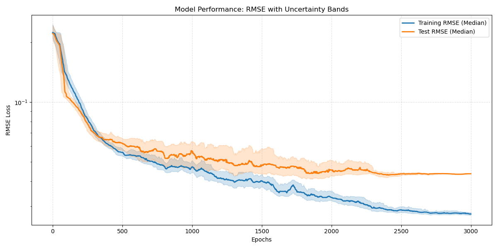
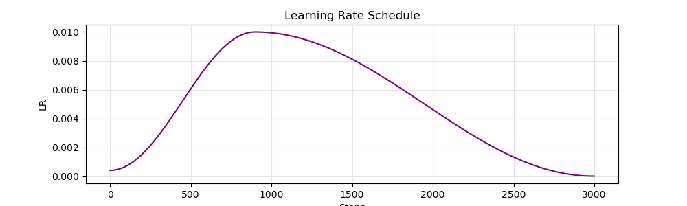
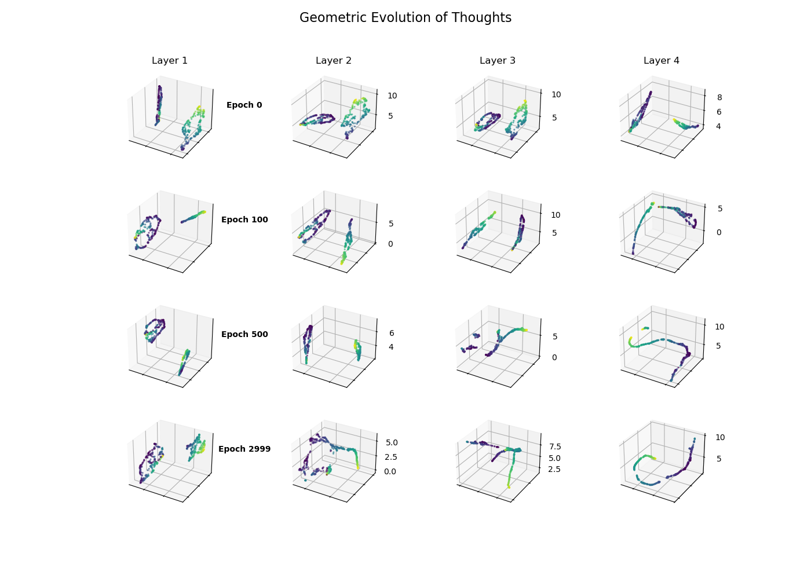
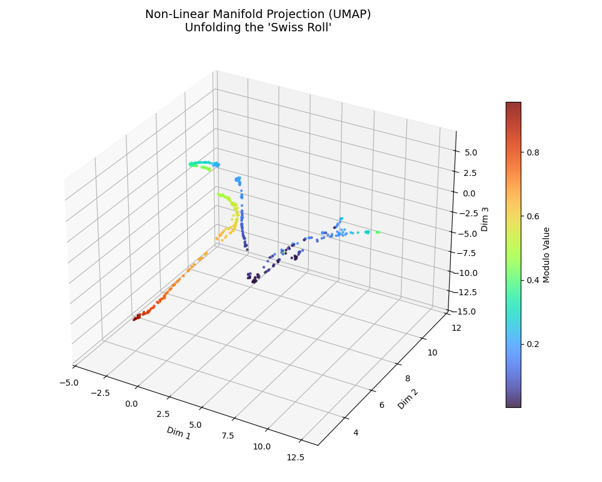
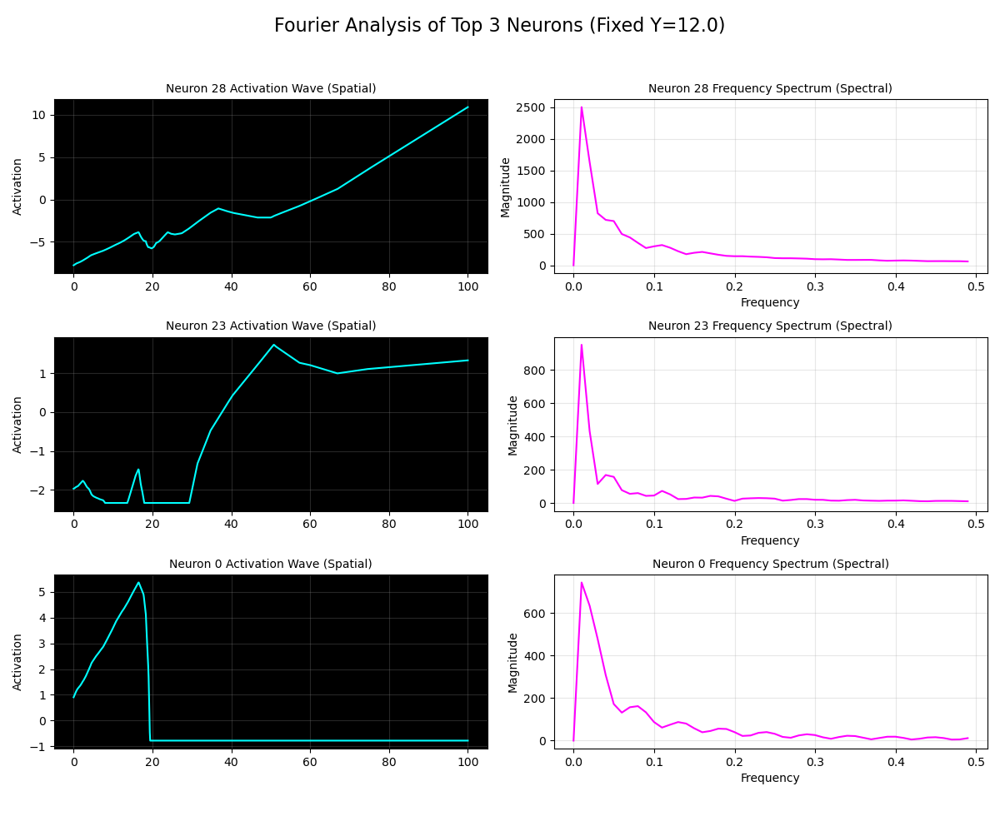
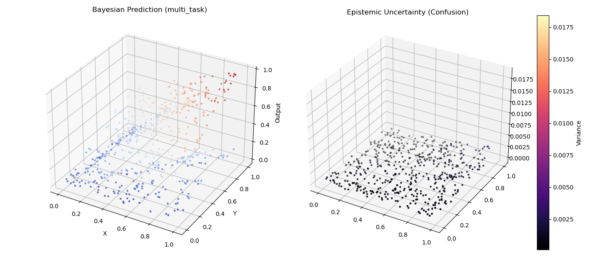

# Mechanistic Interpretability: Geometry & Waves in Neural Networks

This project explores how Neural Networks learn to solve mathematical tasks—specifically **Addition** (Linear) and **Modulo Division** (Non-Linear). 

Using advanced visualization techniques like **UMAP**, **Fourier Analysis**, and **Bayesian Uncertainty**, we reverse-engineer the "black box" to reveal the geometric structures and frequency-based mechanisms the network develops to handle multi-task learning.

## 🚀 Getting Started

### 1. Prerequisites
You need **Anaconda** or **Miniconda** installed on your system to manage the environment.
* [Download Anaconda](https://www.anaconda.com/download)
* [Download Miniconda](https://docs.conda.io/en/latest/miniconda.html)

### 2. Installation
Create a new Conda environment and install the necessary dependencies using the provided commands.

```bash
# 1. Create the environment (Python 3.10 recommended)
conda create -n mech_interp python=3.10 -y

# 2. Activate the environment
conda activate mech_interp

# 3. Install core libraries (PyTorch, NumPy, Matplotlib, Scikit-Learn)
# Note: Visit https://pytorch.org/get-started/locally/ if you need a specific CUDA version
conda install pytorch cpuonly -c pytorch
conda install numpy matplotlib scikit-learn jupyterlab -y

# 4. Install UMAP for manifold visualization
pip install umap-learn
```

---

## 📚 Educational Materials

If you are new to Mechanistic Interpretability, start here. These files walk you through the concepts step-by-step with visualizations.

*   **`mechInterp.html`**: A static, pre-rendered report. Open this in your web browser to read the analysis and see the results without running any code.
  
*   **`mechInterp.ipynb`**: An interactive Jupyter Notebook. Run this to execute the code cell-by-cell and modify parameters to see how the network reacts.

---

## 🔬 Running Experiments

To run the full scientific pipeline—including training the model, generating evolutionary snapshots, and performing spectral analysis—run the main python script.

### Configuration
You can edit the configuration at the top of `evolution_umap.py` to change the experiment:
```python
TASK_MODE = "multi_task"  # Options: 'modulo', 'add', 'multi_task'
HIDDEN_LAYERS = 3         # Network depth
HIDDEN_DIM = 64           # Network width
EPOCHS = 3000             # Training duration
```

### Execution
Run the script from your terminal:

```bash
python evolution_umap.py
```

### What to Expect
The script will generate five distinct visualizations windows:

1.  **Performance Metrics:** RMSE Loss curves showing convergence.

    

2.  **Learning Rate:** The OneCycle scheduler curve.
   

3.  **Geometric Evolution:** A grid showing how the neural manifold "unrolls" over time (Epochs 0 to 3000).
   

4.  **Final UMAP Projection:** A high-resolution 3D view of the final "Split-Brain" topology.
   

5.  **Fourier Analysis:** Frequency spectrum plots showing how neurons act as wave detectors.
   

6.  **Bayesian Uncertainty:** A 3D surface plot showing where the model is confident vs. confused.
   

---

## 📂 Project Structure

*   `MechInterp_EXP_1/` - The Python package containing the core logic.
    *   `model.py`: The `ModuloNet` PyTorch architecture.
    *   `data.py`: Data generation for Addition and Modulo tasks.
    *   `analyzer.py`: Engines for UMAP, PCA, Fourier FFT, and Bayesian analysis.
    *   `viz.py`: Matplotlib plotting utilities.
*   `main_complete_analysis.py`: The master script to run the full experiment.
*   `mechInterp.ipynb`: Interactive tutorial.

---

## 🧠 Key Concepts Visualized

*   **Manifold Hypothesis:** How the network "unrolls" the circular modulo function into a linear ribbon.

*   **Task Orthogonality:** How the network separates "Addition" and "Modulo" into distinct geometric subspaces to avoid interference.

*   **Constructive Interference:** How neurons act as "Triangle Waves" (Fourier components) to approximate periodic functions.

